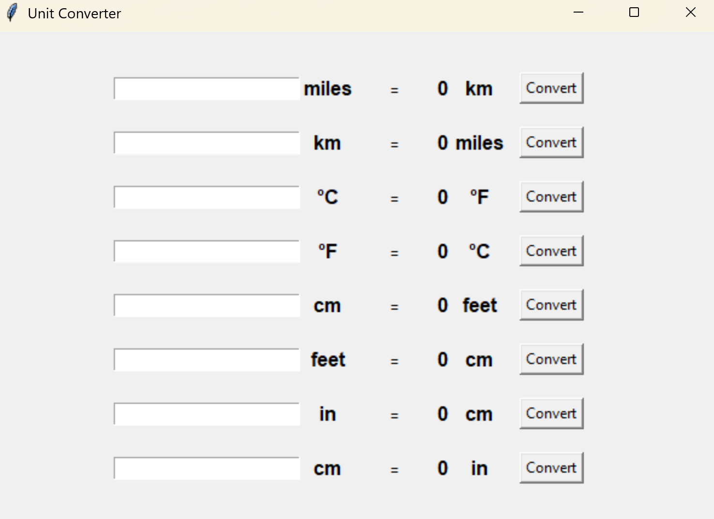

# Unit Converter 🧮

A simple GUI-based unit converter built with Python and Tkinter.

## 🚀 Features
- Converts:
  - Miles ↔ Kilometers
  - Celsius ↔ Fahrenheit
  - Centimeters ↔ Feet and Inches
- Clear and intuitive layout
- Error handling for non-numeric input

## Project Structure
```
unit-converter/
│
├── images/
│   └── demo.png            # Screenshot of the app
├── unit_converter.py       # Main application file
├── README.md               # Project description
└── .gitignore              # Files to ignore in version control
```

## 📦 Requirements
- Python 3.x (Tkinter is included by default)

## Demo


## 🖥️ How to Run
```bash
python unit_converter.py
```


### 💡 Motivation
Part of my Python learning journey (100 Days of Code). 
This project helped reinforce GUI layout, lambda functions, and input validation.

### Future Enhancements
- Add dropdown menus for more dynamic conversions. 
- Include real-time conversion (on input change).

## Author

Justin Woodard
[GitHub](https://github.com/JustinWoo20/JustinWoo20)

